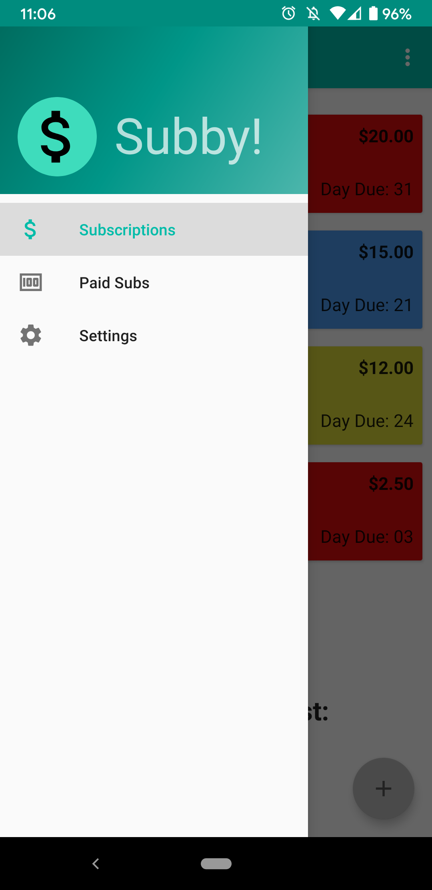
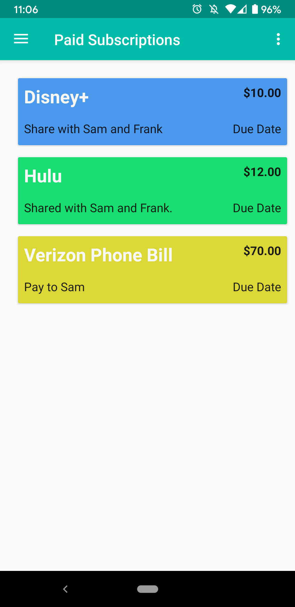
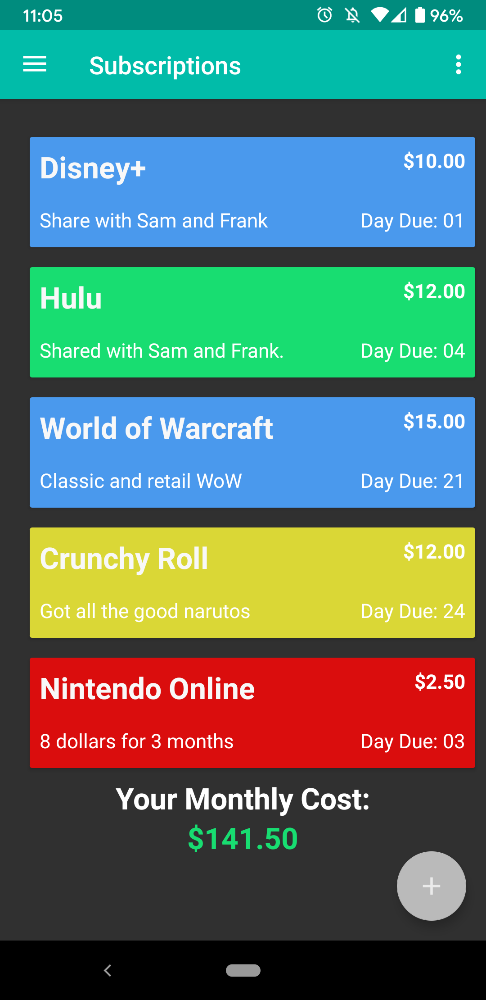

# Subby

Subby is a simple monthly subscription tracker for Android phones. Built utilizing a room database, live-data, broadcasts and alarms to let users track monthly subscriptions and receive notifications on the dates due. 

## Features
* Cutomize Subscription Profiles
* Optional Notifications for Due Dates
* Total Subscription Cost Calculator
* Automatic Monthly Reset
* Dark Theme
* Simple Design

## Screenshots

